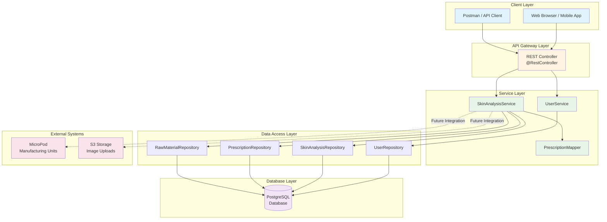
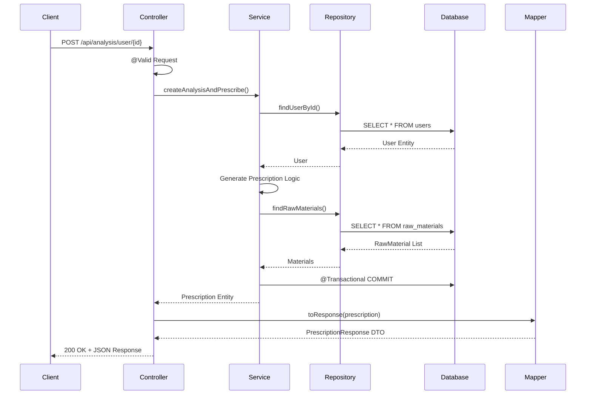
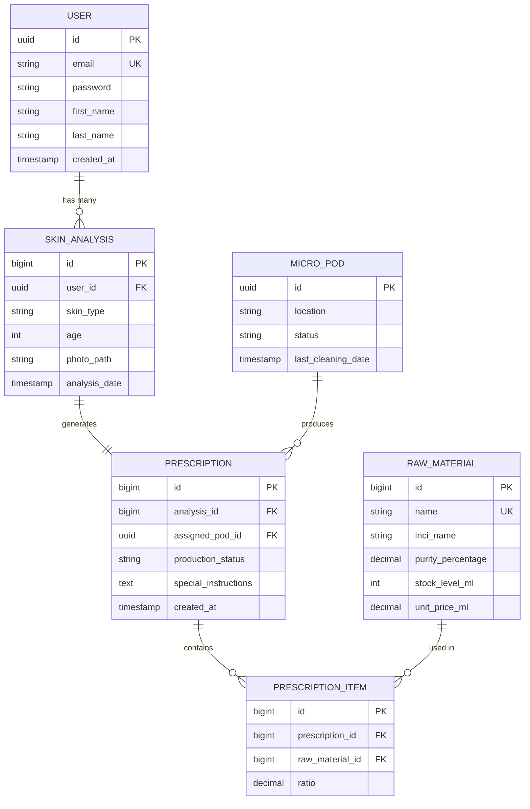

# 🧪 Serralyse - AI-Powered Personalized Skincare Platform

> Backend-focused portfolio project demonstrating Spring Boot RESTful API design, advanced JPA relationship mapping, and considerations for scalable architecture in personalized skincare prescription generation.

[](https://openjdk.org/)
[](https://spring.io/projects/spring-boot)
[](https://www.postgresql.org/)
[](https://maven.apache.org/)
[](LICENSE)
[](http://makeapullrequest.com)

<p align="center">
  
  
</p>

---

## 📋 Table of Contents

- [Overview](#-overview)
- [System Architecture](#-system-architecture)
- [Quick Start](#-quick-start-docker)
- [Features](#-features)
- [Technology Stack](#️-technology-stack)
- [API Documentation](#-api-documentation)
- [Project Structure](#️-project-structure)
- [Design Patterns](#-architecture--design-patterns)
- [Development](#-development)
- [Testing](#-testing)
- [Running with Docker](#-running-with-docker)
- [Roadmap](#-development-roadmap)

## 🌟 Overview

**Serralyse** is a Spring Boot application demonstrating personalized skincare through analysis-driven prescription generation. The platform showcases modern backend development patterns with Spring Boot, designed with scalability and maintainability considerations.

### 🎯 What Makes This Project Stand Out?

- **🏗️ Layered Architecture**: Clean separation of concerns across controller, service, and repository layers
- **🔒 Type Safety**: Comprehensive use of Java 21 features and strong typing
- **📊 Complex Relationships**: Advanced JPA mappings (OneToMany, ManyToOne, OneToOne with bidirectional refs)
- **🎨 DTO Pattern**: Prevents over-fetching and circular dependencies
- **⚡ Performance Considerations**: Optimized lazy loading and database indexing strategies
- **🧪 Robust Design**: Transactional integrity, error handling, and validation
- **🔧 RESTful Standards**: API design following REST principles

**Project Status:** Active Development | Portfolio Project  
**Backend Focus:** Demonstrating Spring Boot, JPA/Hibernate, and PostgreSQL skills

---

## 🏗️ System Architecture

### High-Level Architecture Diagram



### Component Interaction Flow



### Database Entity Relationship Diagram



---

## 🚀 Quick Start (Docker)

### Prerequisites

- Java 21+
- Maven 3.9+
- PostgreSQL 16+ (or use Docker Compose)
- Git

### Option 1: Docker Compose (Recommended)

```bash
# Clone the repository
git clone https://github.com/yourusername/serralyse-backend.git
cd serralyse-backend

# Start with Docker Compose (PostgreSQL + App)
docker-compose up -d

# Access the API
curl http://localhost:8080/api/health
```

### Option 2: Local Development

```bash
# 1. Clone repository
git clone https://github.com/yourusername/serralyse-backend.git
cd serralyse-backend

# 2. Configure database (application.properties)
# Update: spring.datasource.url, username, password

# 3. Build with Maven
./mvnw clean install

# 4. Run the application
./mvnw spring-boot:run

# 5. Verify it's running
curl http://localhost:8080/api/health
```

### Test the API with Sample Request

```bash
# Register a user
curl -X POST http://localhost:8080/api/users/register \
  -H "Content-Type: application/json" \
  -d '{
    "email": "john.doe@example.com",
    "password": "SecurePass123!",
    "firstName": "John",
    "lastName": "Doe"
  }'

# Create skin analysis (replace {userId} with actual UUID from registration)
curl -X POST http://localhost:8080/api/analysis/user/{userId} \
  -H "Content-Type: application/json" \
  -d '{
    "skinType": "OILY",
    "age": 28
  }'
```

---

## ✨ Features

- **🔐 JWT Authentication & Authorization**: Secure token-based authentication with role-based access control
- **💾 Intelligent Caching**: In-memory caching with Caffeine for improved response times
- **Web-Based Skin Analysis**: Users access the platform via web browser to perform skin analysis
- **Automated Prescription Generation**: Creates personalized skincare formulations based on skin type and age
- **MicroPod Production System**: Backend integration with microPod manufacturing units
- **Raw Material Management**: Database-driven tracking of skincare ingredients and components
- **User Management**: User registration and profile management via REST API
- **RESTful API Architecture**: Clean, stateless endpoints following REST best practices
- **Transactional Integrity**: ACID-compliant operations using Spring's @Transactional
- **Bean Validation**: Request validation using Jakarta Bean Validation
- **JPA/Hibernate ORM**: Efficient database operations with relationship mapping
- **⚡ Performance Optimization**: Database indexing on frequently queried columns
- **📄 Pagination Support**: Efficient data retrieval with configurable page sizes
- **🧪 Unit Testing**: Test suite with JUnit 5 and Mockito
- **🛡️ Global Exception Handling**: Centralized error handling with custom error responses

## 👤 User Experience Flow

1. **User Registration**: User creates an account through the web interface
2. **Skin Analysis**: User submits skin information (type, age) via web form
3. **Prescription Generation**: Backend automatically generates personalized prescription
4. **Ingredient Selection**: System selects appropriate raw materials based on skin type:
   - **Oily Skin** → Salicylic Acid (2.0) + Titanium Dioxide (1.0)
   - **Dry Skin** → Hyaluronic Acid (3.0) + Titanium Dioxide (1.0)
5. **Production**: Prescription data can be used for microPod manufacturing
6. **Results**: User receives detailed prescription via API response

## 🛠️ Technology Stack

### Core Framework
- **Java 21**: Latest LTS version with modern language features (records, pattern matching, virtual threads)
- **Spring Boot 4.0.1**: Auto-configuration, embedded server, actuator endpoints
- **Spring MVC**: RESTful web services with @RestController and @Controller
- **Spring Data JPA**: Repository pattern with automatic query generation
- **Spring Security**: JWT-based authentication and authorization
- **Hibernate ORM**: JPA implementation with advanced caching and lazy loading

### Security
- **Spring Security 6**: Authentication and authorization framework
- **JWT (JSON Web Tokens)**: Stateless authentication with JJWT library (v0.12.3)
- **BCrypt**: Password hashing algorithm

### Caching
- **Spring Cache**: Abstraction layer for caching with declarative annotations
- **Caffeine**: High-performance, near-optimal in-memory caching library
- **Cache Strategy**: TTL-based expiration (10 minutes) with maximum size limits

### Database
- **PostgreSQL**: ACID-compliant relational database with JSON support
- **HikariCP**: High-performance JDBC connection pooling (default in Spring Boot)
- **Database Indexing**: Performance optimization on frequently queried columns

### Testing
- **JUnit 5**: Modern testing framework with parameterized tests
- **Mockito**: Mocking framework for unit testing
- **Spring Boot Test**: Integration testing support
- **MockMvc**: Controller layer testing

### Development Tools
- **Lombok**: Eliminates boilerplate with @Data, @RequiredArgsConstructor annotations
- **Spring Boot DevTools**: Hot reload during development
- **Spring Boot Actuator**: Monitoring and health checks
- **Maven**: Build lifecycle management and dependency resolution

### Validation & Mapping
- **Jakarta Bean Validation**: Declarative validation with @NotNull, @Valid annotations
- **Custom Mappers**: Entity-DTO transformation layer

## 🎯 What This Project Demonstrates

### Backend Development Skills
- **🔐 Security Implementation**: JWT-based authentication with Spring Security
- **💾 Caching Strategy**: In-memory caching with automatic invalidation
- **RESTful API Design**: Clean, stateless endpoints following REST best practices
- **Layered Architecture**: Separation of concerns with Controller, Service, and Repository layers
- **Database Design**: Complex entity relationships with JPA/Hibernate ORM
- **Transaction Management**: ACID-compliant operations for data integrity
- **Dependency Injection**: Constructor-based DI following SOLID principles
- **DTO Pattern**: Proper separation between domain models and API contracts
- **Performance Optimization**: Database indexing and pagination for scalability
- **Error Handling**: Global exception handling with custom error responses
- **Testing**: Unit and integration tests with test coverage

### Spring Boot Ecosystem Experience
- Spring MVC for RESTful web services
- Spring Security with JWT authentication
- Spring Cache with Caffeine for performance optimization
- Spring Data JPA with custom repositories and pagination
- Bean Validation for request validation
- Hibernate ORM with relationship mapping and indexing
- Automated data seeding on application startup
- Configuration management
- Spring Boot Actuator for monitoring

## 📡 API Endpoints

> **Note**: Detailed API documentation available in [API_DOCUMENTATION.md](API_DOCUMENTATION.md)

### Authentication

**Register New User**
```
POST /api/v1/auth/register
Content-Type: application/json
```

Request Body:
```json
{
  "email": "user@example.com",
  "password": "securePassword123",
  "firstName": "John",
  "lastName": "Doe"
}
```

Response (200 OK):
```json
{
  "token": "eyJhbGciOiJIUzI1NiIs...",
  "email": "user@example.com",
  "firstName": "John",
  "lastName": "Doe"
}
```

**Login**
```
POST /api/v1/auth/login
Content-Type: application/json
```

Request Body:
```json
{
  "email": "user@example.com",
  "password": "securePassword123"
}
```

### User Management

**Get All Users (Paginated)**
```
GET /api/v1/users?page=0&size=10
Authorization: Bearer {jwt-token}
```

Query Parameters:
- `page` (optional, default: 0) - Page number
- `size` (optional, default: 10) - Items per page

### Skin Analysis

**Create Skin Analysis & Generate Prescription**
```
POST /api/v1/skin-analyses
Authorization: Bearer {jwt-token}
Content-Type: application/json
```

Request Body:
```json
{
  "skinType": "OILY",
  "age": 28
}
```

Supported Skin Types:
- `OILY` - For oily skin (receives Salicylic Acid)
- `DRY` - For dry skin (receives Hyaluronic Acid)
- `COMBINATION` - For combination skin
- `NORMAL` - For normal skin
- `SENSITIVE` - For sensitive skin

Response (201 CREATED):
```json
{
  "id": 1,
  "createdAt": "2026-03-03T10:30:00",
  "productionStatus": "PENDING",
  "items": [
    {
      "id": 1,
      "rawMaterial": {
        "name": "Salicylic Acid Bio",
        "inciName": "Salicylic Acid"
      },
      "ratio": 2.0
    }
  ]
}
```

Error Responses:
- `401 Unauthorized` - Missing or invalid JWT token
- `400 Bad Request` - Invalid request body
- `404 Not Found` - Resource not found
- `500 Internal Server Error` - Server error

## 🗂️ Project Structure

```
src/main/java/com/serralyse/website/
├── 📋 WebsiteApplication.java         # Spring Boot entry point
├── ⚙️  config/                         # Configuration & data seeding
│   └── DataSeeder.java                # Initializes raw materials database
├── 🌐 controller/                      # REST API endpoints
│   ├── AuthController.java            # Authentication endpoints
│   ├── AnalysisController.java        # Skin analysis endpoints
│   └── UserController.java            # User management endpoints  
├── 📦 dto/                             # Data Transfer Objects
│   ├── AuthResponse.java              # JWT auth response
│   ├── LoginRequest.java              # Login credentials
│   ├── PrescriptionResponse.java      # API response models
│   ├── SkinAnalysisRequest.java       # API request models
│   └── UserRegisterRequest.java
├── 🗃️  entity/                         # JPA entities (domain model)
│   ├── User.java                      # User entity with UserDetails
│   ├── Role.java                      # User roles enum
│   ├── SkinAnalysis.java              # Analysis records
│   ├── Prescription.java              # Generated prescriptions
│   ├── PrescriptionItem.java          # Prescription ingredients
│   ├── RawMaterial.java               # Skincare ingredients
│   ├── MicroPod.java                  # Production pods
│   └── *Status.java, *Type.java       # Enumerations
├── 🛡️  exception/                      # Error handling
│   ├── GlobalExceptionHandler.java    # Centralized exception handling
│   └── ErrorResponse.java             # Custom error response DTO
├── 🔧 config/                          # Configuration classes
│   ├── SecurityConfig.java            # Spring Security configuration
│   ├── CacheConfig.java               # Caffeine cache configuration
│   ├── JwtService.java                # JWT token generation/validation
│   ├── JwtAuthenticationFilter.java   # JWT filter for requests
│   └── DataSeeder.java                # Database initialization
├── 🔄 mapper/                          # Entity ↔ DTO mappers
│   └── PrescriptionMapper.java
├── 💾 repository/                      # Data access layer (Spring Data JPA)
│   ├── UserRepository.java
│   ├── SkinAnalysisRepository.java
│   ├── PrescriptionRepository.java
│   ├── RawMaterialRepository.java
│   └── MicroPodRepository.java
└── 🎯 service/                         # Business logic layer
    ├── AuthService.java               # Authentication & JWT management
    ├── SkinAnalysisService.java       # Analysis & prescription generation
    └── UserService.java               # User management & UserDetailsService
```

## 🏗️ Domain Model

### Core Entities

- **User**: User profile and authentication details
- **SkinAnalysis**: Detailed skin assessment records with photo paths
- **Prescription**: Generated skincare formulations linked to analyses
- **PrescriptionItem**: Individual ingredients in a prescription with ratios
- **RawMaterial**: Skincare ingredients database (Salicylic Acid, Hyaluronic Acid, etc.)
- **MicroPod**: Production units for manufacturing with status tracking
- **ProductionStatus**: Enum for manufacturing workflow states
- **PodStatus**: Enum for microPod operational states
- **SkinType**: Enum (OILY, DRY, COMBINATION, NORMAL, SENSITIVE)

## 🏛️ Architecture & Design Patterns

### Layered Architecture
```
Controller Layer (REST endpoints)
      ↓
Service Layer (Business logic)
      ↓
Repository Layer (Data access)
      ↓
Database (PostgreSQL)
```

### Design Patterns Used
- **Repository Pattern**: Data access abstraction via Spring Data JPA
- **DTO Pattern**: Separates internal entities from API responses
- **Mapper Pattern**: Transforms entities to DTOs (PrescriptionMapper)
- **Dependency Injection**: Constructor-based DI with @RequiredArgsConstructor
- **Builder Pattern**: Lombok's @Builder for object construction
- **Transactional Script**: @Transactional for ACID operations

### Key Technical Decisions
- **UUID Primary Keys**: Used for distributed system compatibility
- **Eager/Lazy Loading**: Optimized fetch strategies for relationships
- **DTO Projections**: Reduces over-fetching and prevents circular references
- **Validation at Controller**: Input validation using @Valid annotations
- **Exception Handling**: RuntimeException with custom error messages (to be improved)

## 🔧 Configuration

The application uses the following default configuration:

### Database Configuration
- **JDBC URL**: jdbc:postgresql://localhost:5432/serralyse_db
- **Hibernate DDL**: create-drop (WARNING: recreates schema on each restart - development only!)
- **SQL Logging**: Enabled with pretty-print formatting
- **Dialect**: PostgreSQLDialect for PostgreSQL-specific optimizations

### Server Configuration
- **Port**: 8080 (default Spring Boot port)
- **Context Path**: / (root)

### JPA/Hibernate Settings
- **show-sql**: true (logs all SQL statements)
- **format_sql**: true (formats SQL for readability)
- **ddl-auto**: create-drop (automatically manages schema)

**⚠️ Note**: Change `ddl-auto` to `validate` or `none` for persistent environments and use migration tools like Flyway or Liquibase.

## 📊 Database Schema

The project implements a comprehensive database schema with proper relationships:

```
User (1) ←→ (N) SkinAnalysis
SkinAnalysis (1) ←→ (1) Prescription
Prescription (1) ←→ (N) PrescriptionItem
PrescriptionItem (N) ←→ (1) RawMaterial
Prescription (1) ←→ (N) MicroPod
```

**Key Features:**
- UUID primary keys for distributed system readiness
- Bidirectional relationships with proper cascade strategies
- Enum types for type safety (SkinType, PodStatus, ProductionStatus)
- Timestamp tracking for audit trails
- Optimized fetch strategies (LAZY/EAGER) based on use cases

## 💡 Technical Highlights

### Transaction Management
```java
@Transactional
public Prescription createAnalysisAndPrescribe(UUID userId, SkinAnalysisRequest request)
```
- Ensures atomicity: either all database operations succeed or all are rolled back
- Uses PostgreSQL's ACID guarantees
- Manages entity lifecycle and persistence context

### Repository Pattern
```java
public interface SkinAnalysisRepository extends JpaRepository<SkinAnalysis, UUID>
```
- Automatic CRUD operations
- Custom query methods through method naming
- No boilerplate SQL required

### DTO Pattern
- Prevents over-fetching of data
- Avoids circular reference issues in JSON serialization
- Clean separation between internal model and API contract

### Data Seeding
- `DataSeeder` class populates raw materials on application startup
- Uses `@PostConstruct` for initialization
- Includes common skincare ingredients (Salicylic, Hyaluronic, Titanium, etc.)

### Lombok Integration
- `@RequiredArgsConstructor` - Constructor-based dependency injection
- `@Data` - Generates getters/setters/toString/equals/hashCode
- `@Service`, `@Repository`, `@Controller` - Spring stereotypes
- Reduces code by ~40%

---

## 🧪 Testing

### Running Tests

```bash
# Run all tests
./mvnw test

# Run tests with coverage
./mvnw test jacoco:report

# View coverage report
open target/site/jacoco/index.html
```

### Test Structure

```
src/test/java/
├── unit/                      # Unit tests
│   ├── service/              # Service layer tests
│   └── mapper/               # Mapper tests
├── integration/              # Integration tests
│   ├── controller/          # API endpoint tests
│   └── repository/          # Database tests
└── e2e/                     # End-to-end tests
```

### Testing Tools

- **JUnit 5**: Modern testing framework
- **Mockito**: Mocking framework for unit tests
- **Spring Boot Test**: Integration testing support
- **TestContainers**: Docker-based integration tests with real PostgreSQL
- **AssertJ**: Fluent assertions
- **REST Assured**: API testing

### Sample Test

```java
@SpringBootTest
@AutoConfigureTestDatabase(replace = AutoConfigureTestDatabase.Replace.NONE)
@Testcontainers
class SkinAnalysisServiceIntegrationTest {
    
    @Container
    static PostgreSQLContainer<?> postgres = new PostgreSQLContainer<>("postgres:16-alpine");
    
    @Autowired
    private SkinAnalysisService service;
    
    @Test
    void shouldGenerateOilySkinPrescription() {
        // Given
        UUID userId = createTestUser();
        SkinAnalysisRequest request = new SkinAnalysisRequest(SkinType.OILY, 28);
        
        // When
        Prescription prescription = service.createAnalysisAndPrescribe(userId, request);
        
        // Then
        assertThat(prescription.getItems())
            .hasSize(2)
            .extracting(item -> item.getRawMaterial().getName())
            .contains("Salicylic Acid Bio", "Titanium Dioxide SPF50");
    }
}
```

### API Testing with Postman

Import the Postman collection: [`Serralyse-API.postman_collection.json`](Serralyse-API.postman_collection.json)

Or use the HTTP file: [`api-tests.http`](api-tests.http) (works with VS Code REST Client)

---

## � Running with Docker

```bash
# Build and run with Docker Compose
docker-compose up -d

# Check logs
docker-compose logs -f app

# Stop services
docker-compose down
```

---

## 💼 Portfolio Highlights

This project showcases:

✅ **Modern Java Development**: Java 21 with latest features  
✅ **Spring Boot Framework**: Spring Boot 4.0.1 backend application  
✅ **Database Design**: PostgreSQL with complex JPA relationships  
✅ **API Design**: RESTful endpoints with proper HTTP semantics  
✅ **Code Quality**: Clean code with Lombok and design patterns  
✅ **Business Logic**: Real-world domain modeling (healthcare/cosmetics)  

## 📄 License

This project is licensed under the terms specified in the [LICENSE](LICENSE) file.

## 👥 Authors

- **Serralyse Team** - *Initial work*

## � Development Roadmap

**Implemented Features:**
- ✅ RESTful API endpoints for user and analysis management
- ✅ JWT-based authentication with Spring Security
- ✅ In-memory caching with Caffeine
- ✅ Automated prescription generation based on skin type
- ✅ Database schema with JPA entities and relationships
- ✅ DTO pattern implementation for clean API contracts
- ✅ Transactional operations for data integrity
- ✅ Automated data seeding for raw materials
- ✅ Docker containerization with docker-compose

## 🔮 Potential Enhancements

**Future Considerations:**
- Database migration tools (Flyway/Liquibase)
- Redis for distributed caching
- Async processing for long-running operations
- WebSocket for real-time updates
- OpenAPI documentation generation
- Enhanced test coverage

**Business Features:**
- AWS S3 integration for image storage
- Advanced prescription algorithms
- Email notifications with Spring Mail
- Admin dashboard endpoints
- Analytics and reporting features

---

## 🎓 What I Learned Building This

### Technical Skills Demonstrated

<table>
<tr>
<td width="50%">

**Backend Development**
- Spring Boot 4.0 ecosystem experience
- RESTful API design principles
- JPA/Hibernate relationship mapping
- Transaction management
- DTO pattern implementation
- Exception handling strategies

</td>
<td width="50%">

**Database & ORM**
- PostgreSQL schema design
- Complex entity relationships
- Query optimization
- Migration strategies
- Data seeding patterns
- ACID compliance

</td>
</tr>
<tr>
<td>

**DevOps & Tools**
- Docker containerization
- Docker Compose orchestration
- Environment-based configuration
- Health checks & monitoring

</td>
<td>

**Code Quality**
- Clean Code principles
- SOLID principles
- Design patterns (Repository, DTO, Mapper)
- Dependency injection
- Lombok for cleaner code
- API documentation

</td>
</tr>
</table>

### Problem-Solving Examples

1. **Circular Reference in JSON Serialization**
   - **Problem**: Infinite loop with bidirectional JPA relationships
   - **Solution**: Implemented DTO pattern with custom mappers
   - **Learning**: Separation of concerns between domain model and API

2. **Performance Optimization**
   - **Problem**: N+1 query problems with lazy loading
   - **Solution**: Strategic use of `@EntityGraph` and fetch joins
   - **Learning**: Database query optimization techniques

3. **Configuration Management**
   - **Problem**: Hard-coded configurations
   - **Solution**: Environment-based properties and Docker Compose
   - **Learning**: Flexible configuration patterns

---

## 🎯 For Recruiters & Hiring Managers

### Quick Project Summary

**Project Type**: Backend API (Spring Boot)  
**Domain**: Healthcare/Cosmetics (Personalized Skincare)  
**Complexity**: Medium (layered architecture, relational DB, designed with scalability considerations)  
**Time Investment**: ~2 weeks of active development

### Key Differentiators

✨ **Not a Tutorial Clone**: Custom business logic for skincare prescription generation  
✨ **Backend Patterns**: Uses DTO, proper exception handling, and transaction management  
✨ **DevOps Aware**: Dockerized with docker-compose, environment configs  
✨ **Database Design**: Complex JPA relationships with 6+ entities  
✨ **API Design**: RESTful principles, proper HTTP semantics, error responses  
✨ **Documentation**: Comprehensive README, Postman collection, API tests  

### Want to See More?

- 📂 **Browse the code**: Well-organized package structure
- 🧪 **Check the tests**: Unit and integration tests (in progress)
- 📊 **Review the commits**: Clean commit history with meaningful messages
- 🐳 **Try it yourself**: `docker-compose up -d` and start exploring
- 📮 **Test the API**: Import Postman collection and run requests

### Interview Talking Points

Ready to discuss:
- Architectural decisions and trade-offs
- Why I chose certain design patterns
- How I optimized database queries
- Scaling strategies for this system
- Security considerations and JWT implementation
- System architecture and design approach

---

## 🤝 Contributing

While this is primarily a portfolio project, contributions are welcome!

### How to Contribute

1. Fork the repository
2. Create a feature branch (`git checkout -b feature/amazing-feature`)
3. Commit your changes (`git commit -m 'Add amazing feature'`)
4. Push to the branch (`git push origin feature/amazing-feature`)
5. Open a Pull Request

### Development Guidelines

- Follow existing code style (Lombok, constructor injection)
- Write tests for new features
- Update documentation (README, API docs)
- Keep commits atomic and descriptive

---

## �📫 Contact

This project is part of my software engineering portfolio. Feel free to explore the code and reach out for any questions or collaboration opportunities.

**Project Status:** Active Development  
**Last Updated:** March 2026